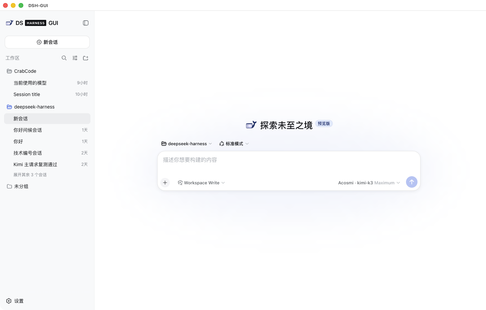
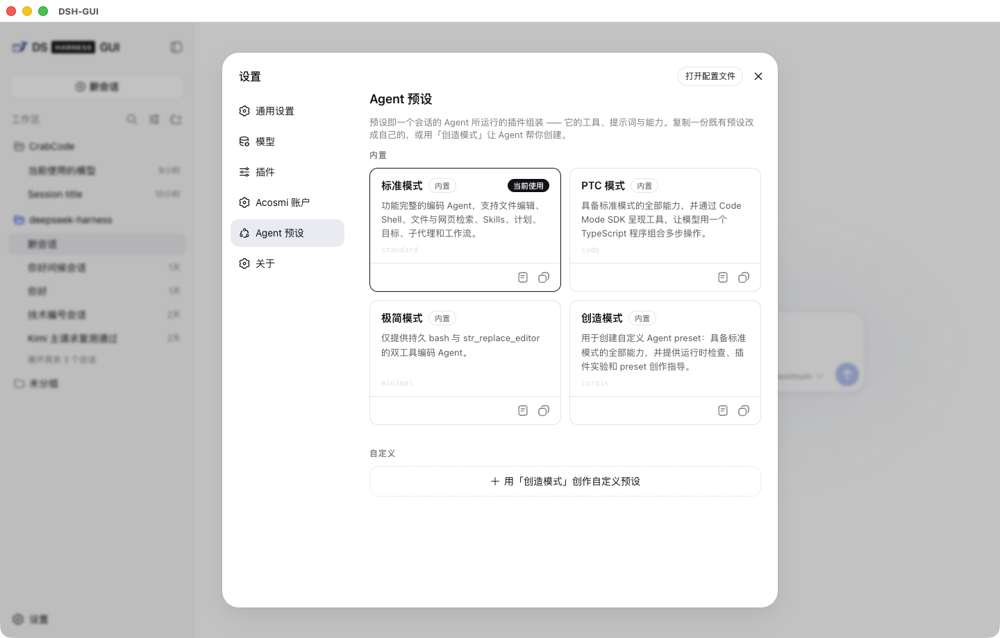

# DS Harness GUI

<p align="center"></p>

中文（默认） | [English](README.en.md)

DS Harness GUI 是 Acosmi 基于开源 [DeepSeek Harness](https://github.com/deepseek-ai/deepseek-harness) 构建的社区桌面发行版，面向 macOS 与 Windows。它保留 Harness 的插件架构、会话日志、工具与权限机制，并增加 Electron 桌面运行时、Acosmi 账户与模型接入、发行账本、平台打包及产品品牌。

本项目不是 DeepSeek 官方产品，也不代表 DeepSeek 提供支持或背书。`DS Harness GUI`、鲸鱼浏览器图标与 `@acosmi/*` 包属于 Acosmi 的下游发行层；`@deepseek-ai/*` 源码及 DeepSeek Harness 名称仅用于说明上游来源。

## 一个界面里的本地 AI Agent 工作台

不用折腾 Node、终端，打开就能用本地 AI Agent 工作台。Sessions、项目管理、文件处理、Web Research、插件系统、Office 自动化……全部整合在一个界面里，丝滑上手。

<p align="center">
  
  
</p>

## 当前状态

本仓库处于开发者预览阶段，尚未达到 stable 公开发行条件。

- 源码构建、类型检查、lint、桌面相关单元测试、无密钥组装快照、renderer 资源完整性与开发包打包路径已经在 macOS arm64 上验证。
- Acosmi SDK 固定为 `2.17.0`，原生 OAuth `state` 校验已经随该版本发布；Nexus `web_search` 重名故障也已在服务端修复并部署。
- Kimi K3 与 Acosmi DeepSeek 的真实已认证续轮、并行工具调用及跨模型切换仍需要在已登录 Canary 中完成最终验证。代码检查通过不等于真实服务验收已经完成。
- 当前 macOS 开发包仅构成 ad hoc 本地证据。Developer ID 身份已经记录并可精确选择，但公证凭据、最终 arm64/x64 签名与 staple、Windows x64 打包和签名、更新渠道、法律与支持输入仍受发行账本阻塞。
- `pnpm run desktop:verify` 会报告当前发行阻塞项；开发构建可以继续，stable 签名与发布会失败关闭。

<a id="run"></a>

## 从源码运行

需要 Node.js `^22.19.0 || >=24` 与 pnpm。

```sh
git clone https://github.com/acosmi/DS-Harness-GUI.git
cd DS-Harness-GUI
pnpm install
```

### 桌面应用

```sh
pnpm run desktop:dev
```

`desktop:dev` 会构建工作区与桌面应用，然后启动 Electron。Acosmi 模型需要在应用内进入“设置 → Acosmi Account → 登录”并完成浏览器授权；官方 DeepSeek 提供方则按仓库现有凭据约定读取配置。

<a id="run-from-source"></a>

### Web UI 与通用 Harness

```sh
pnpm run build
pnpm dsh web
```

`pnpm run build` 会准备仓库构建产物；`pnpm dsh web` 直接使用这些产物，不会重新构建。它默认在 `http://127.0.0.1:3080` 启动 Web UI，并在本机启动时用默认浏览器打开页面；通过 SSH 启动时只会打印宿主地址，因为本地转发地址由 SSH 客户端或编辑器管理。传入 `--no-open` 可仅运行服务器而不打开浏览器。通用 Harness 使用说明见 [Web UI 指南](docs/user/guide/index.zh.md)。

常用命令：

```sh
pnpm run build             # 构建库、Web UI 与桌面应用
pnpm run test:desktop      # 运行 downstream 桌面测试
pnpm run typecheck         # Host-before-Client 类型检查
pnpm run lint              # 仓库 lint
pnpm run desktop:verify    # 校验发行账本并列出阻塞项
pnpm run desktop:package   # 为当前宿主生成未受信的开发安装包
pnpm run desktop:package:mac:candidate # 生成已签名/公证的 arm64 与 x64 证据
pnpm run clean             # 清理可再生构建产物
```

## 仓库结构

| 路径 | 用途 |
|---|---|
| `downstream/apps/desktop/` | Electron main、preload、utility process、renderer 与平台打包入口 |
| `downstream/packages/` | Acosmi 账户、模型提供方、桌面运行时、品牌界面及更新能力 |
| `downstream/bundles/desktop/` | 固定的生产插件组合 |
| `downstream/release/` | 身份、外部输入、职责、原生模块、支持矩阵与上游基线账本 |
| `packages/`、`vendor/` | DeepSeek Harness 与 vendored Cordis 的上游源码层 |
| `assets/branding/` | DS Harness GUI 的产品标志源文件 |

通用 Harness 架构见[架构文档](docs/architecture.zh.md)；桌面运行与安全约定见[桌面应用说明](downstream/apps/desktop/README.zh.md)；发行阻塞语义见[发行账本说明](downstream/release/README.zh.md)。

## 安全与发行边界

- 不要提交 `.env`、API key、OAuth token、Apple/Windows 密码、私钥、P12、公证凭据或服务器登录密钥。
- 仓库只记录公开证书元数据和无秘密的校验规则；本机钥匙串身份不会被导出或上传。
- production 只加载固定桌面组合和打包后的 `app://` 资源，不启用远程代码或持久开发监听器。
- 内部实施方案、交接草稿与操作凭据不属于公开源码分发；仓库文档只陈述当前实现、使用约定与可验证限制。

## 上游同步与贡献

`upstream` 应指向 `https://github.com/deepseek-ai/deepseek-harness.git`，产品仓库 `origin` 指向 Acosmi。通用能力优先留在上游 `packages/**` 扩展点，Acosmi 产品策略、账户、Electron、品牌、打包与发行逻辑留在 `downstream/**`。修改前请阅读 [AGENTS.md](AGENTS.md)、[开发指南](docs/development.zh.md)与对应子目录说明。

## 许可证

源码按 [MIT License](LICENSE) 提供。第三方直接依赖及其许可证见 [THIRD_PARTY_NOTICES.md](THIRD_PARTY_NOTICES.md)。MIT 许可不授予 DeepSeek 或其他主体的商标权。
